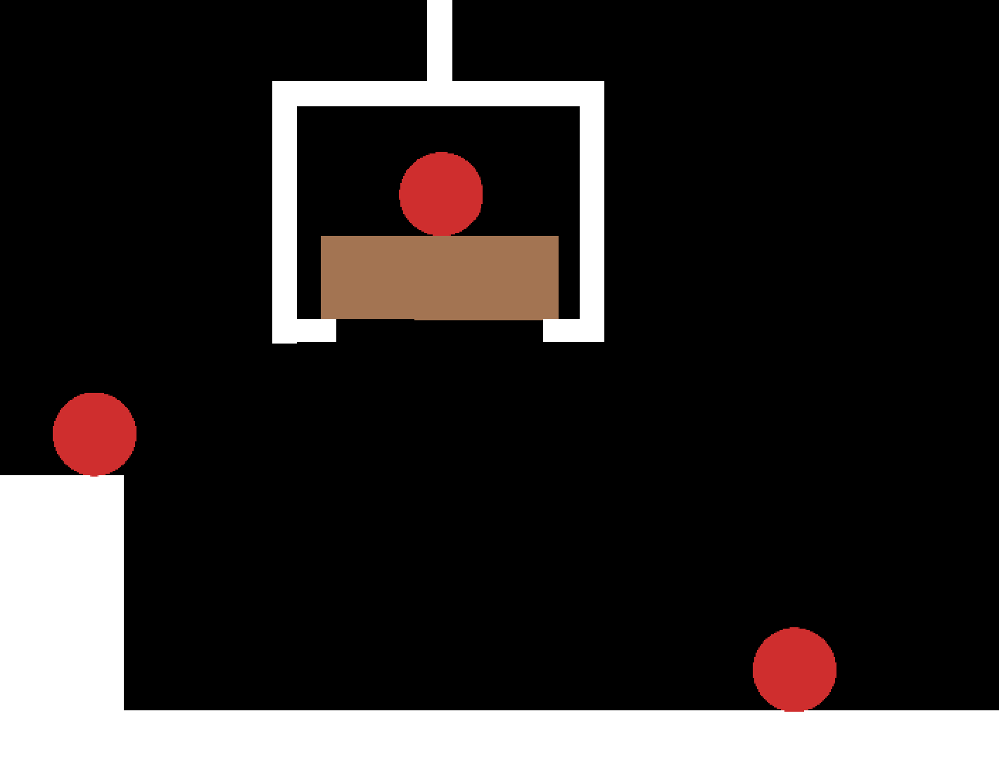
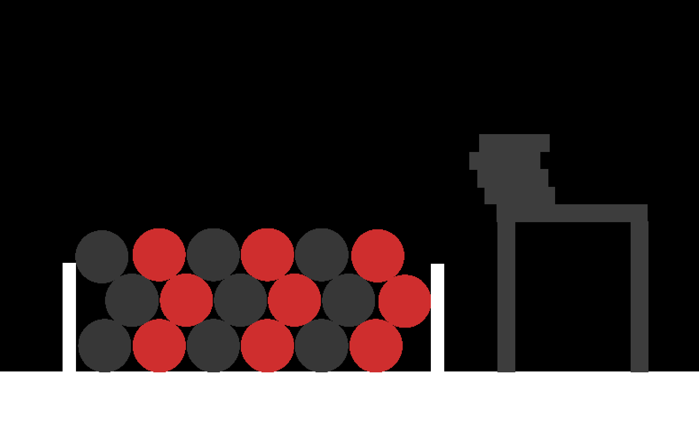
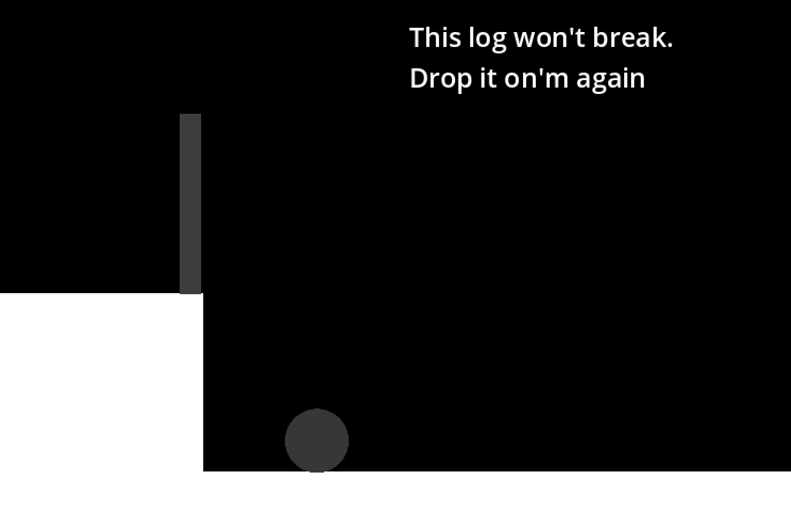

# The Birds Hired a Sniper

You are a sniper hired by some birds. Do your job. This game was made for [jumpstart-daydream](https://daydream.jumpstart.hackclub.com/).

## Overview

This repository was created for a point and click puzzle game in which you eliminate your enemies.

## Links

- [Itch](https://101zh.itch.io/the-birds-hired-a-sniper) <- This is where you play the game!
- [jumpstart-daydream](https://daydream.jumpstart.hackclub.com/)
- 101zh - [Github](https://github.com/101zh), [Itch](https://101zh.itch.io/)

## Workspace

- Godot v4.4.1
- KeyBoard & Mouse

## More Images

## Copyright

Copyright (C) 2025 101zh

This Source Code Form is subject to the terms of the Mozilla Public License, v. 2.0. If a copy of the MPL was not distributed with this file, You can obtain one at https://mozilla.org/MPL/2.0/.
